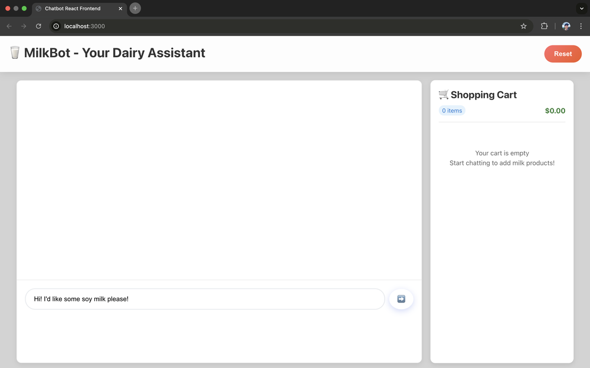

# Mini Projects Monorepo

This is a repo I used to learn new tools and try out project ideas. Below are some highlights:

### [PeanutBot](projects/198-peanutbot/)

GPT-2 finetuned to replace alphanumeric characters with peanut emojis (🥜).

Example conversation:

```
👋: Hello, how are you?
🤖: 🥜🥜! 🥜🥜🥜 🥜🥜.
👋: Who was the first president of the United States?
🤖: 🥜🥜🥜 🥜🥜🥜🥜 "🥜🥜🥜 🥜. 🥜🥜🥜🥜". 🥜🥜🥜🥜 🥜🥜🥜🥜 🥜🥜🥜.
```

Tools:
- Finetuning using **Python** and **Hugging Face**.
- Backend implementation with **Flask**.
- Frontend implementation with **React**.
- Agent implementation with **LangChain**.


### [MilkBot](projects/196-milkbot/)

This is an AI shopping assistant for an online milk store. It can answer questions about milk products, place items into and out of the shopping cart, and initiate checkout.

Tools:
- The catalog of milk products was scraped from the Woolworths website. I had to use headless browsing with **Puppeteer** because the website loads dynamically.
- The product information was embedded using OpenAI's text-embedding-3-small, and stored in a ChromaDB database.
- The AI agent was implemented with **LangChain**.
  - Retrieval-Augmented Generation (RAG) capabilities were implemented where information about products relevant to the user's question was retrieved from the ChromaDB database and augmented to the user's question.
  - Adding and removing items from the shopping cart were implemented as agent tools.
- The backend was implemented with **Flask**.
- The frontend was implemented with **React**.
- The LLM is GPT-5-nano via the **OpenAI API**.



### [Simpsons RAG](projects/192-simpsons-RAG/)

A chatbot that steers conversations toward Simpsons episodes while denying it's doing that.

- Scraped Simpsons episode data from IMDb.
- Generated semantic embeddings of each episode's description using OpenAI's text-embedding-3-small, and stored in a **ChromaDB database**.
- The RAG was implemented with **LangChain**.
- The frontend was implemented with **React**.
- The backend was implemented with **Flask**.
- The LLM is GPT-5-nano via the **OpenAI API**.


### [3D Model Size Visualization](projects/060-cube-zoom-labelled/)

This is a pretty basic 3D visualisation frontend for visualising the relative sizes of notable AI models (in terms of parameter counts) in three dimensions using **Three.js**.

Tools:
- The website uses **Three.js** for the 3D visualisation.
- The data is retrieved from the [Epoch AI](https://epoch.ai) database.


<!--
### [Woolworths Clone](projects/146-woolworths/)


**Responsive E-commerce Interface** - Modern grocery store website with:
- **CSS Grid & Flexbox** for responsive layouts
- **Component-based design** with reusable UI elements
- **Mobile-first approach** with adaptive styling
- **Clean, professional aesthetics** mimicking real e-commerce sites


-->