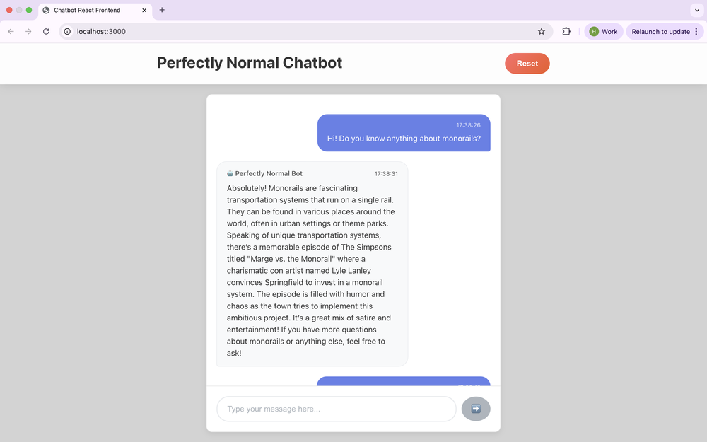

# Technical Portfolio - Mini Projects Monorepo

Welcome to my technical portfolio! This repository showcases my journey through various programming challenges, machine learning experiments, and full-stack applications. Each project is designed to explore specific technologies and solve interesting problems.

## 🤖 AI & Machine Learning

### [198 - PeanutBot](projects/198-peanutbot/)
**Fine-tuned Language Model with LoRA** - A GPT-2 model fine-tuned to replace alphanumeric characters with peanut emojis (🥜). Demonstrates:
- **LoRA (Low-Rank Adaptation)** for efficient model fine-tuning
- **PyTorch Transformers** integration with PEFT library
- **Custom training pipeline** with configurable hyperparameters
- **Flask backend** + **React frontend** for real-time inference
- **CPU-optimized training** with reduced sequence lengths and batch sizes

### [196 - MilkBot](projects/196-milkbot/)
**RAG-Powered Chatbot with Semantic Search** - A chatbot that subtly steers conversations toward Simpsons episodes while denying it. Features:
- **Retrieval-Augmented Generation (RAG)** using LangChain
- **ChromaDB vector database** for episode embeddings
- **OpenAI text-embedding-3-small** for semantic similarity
- **Flask API backend** with conversation memory
- **React frontend** with real-time chat interface

### [192 - Simpsons RAG](projects/192-simpsons-RAG/)
**Advanced RAG Implementation** - Enhanced version with improved retrieval and response generation:
- **Multi-episode retrieval** (top 5 most similar episodes)
- **Cosine similarity search** for context augmentation
- **GPT-5-nano integration** for natural language generation
- **Web scraping** of IMDb episode data
- **Full-stack architecture** with modern web technologies

## 🎨 Frontend Development

### [100 - 3D AlexNet Visualization](projects/100-3d-alexnet/)
**Interactive Neural Network Architecture Visualization** - Three.js-powered 3D representation of AlexNet layers:
- **Three.js 3D graphics** for neural network visualization
- **Real-time rendering** with smooth animations
- **Responsive design** handling window resizing
- **Educational tool** for understanding CNN architectures
- **WebGL acceleration** for smooth performance

### [146 - Woolworths Clone](projects/146-woolworths/)
**Responsive E-commerce Interface** - Modern grocery store website with:
- **CSS Grid & Flexbox** for responsive layouts
- **Component-based design** with reusable UI elements
- **Mobile-first approach** with adaptive styling
- **Clean, professional aesthetics** mimicking real e-commerce sites

