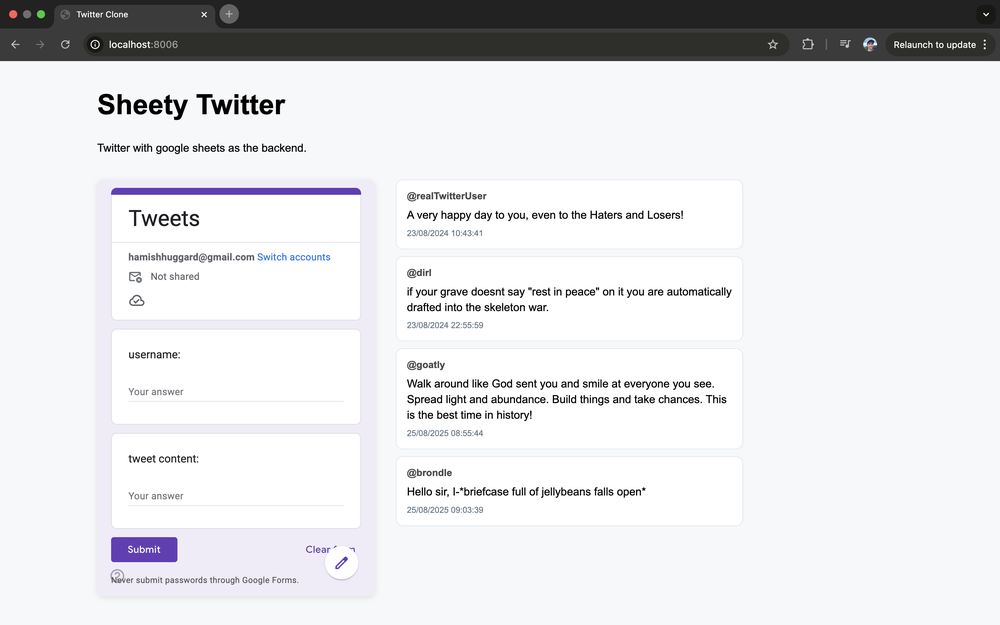

# Twitter with google sheets as the backend

I've been long curious about how far you can get using google sheets as a backend. I previouly used a google sheets backend to [crowdsource a map of a research area](https://hamishhuggard.github.io/AI-alignment-map/). I've also used a google sheets backend to create maps in a minecraft-like 3D game.

The idea with this project is to create a twitter-like app that uses google sheets as the backend.

A google form to post tweets, which are then added to a google sheet which is pulled by the frontend as a csv to populate the page.

