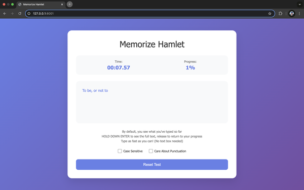

# Memory-Typing Learning Tool

I wanted to create a tool for learning tool, which uses a few pet theories I have about learning:
- I think that for declarative knowledge, learning only really happens when you memorize. 
  - You can clearly feel that your brain is working hard when you memorize in way you seldom do in other tasks.
- 
- I wanted to make this game addictive, fun, and high-adrenaline. 
- Cookie-clicker style games are really addictive.
- [The worlds most dangerous writing app](https://www.theworldsmostdangerouswritingapp.com/) is very high adrenaline.
- Typing games are both high adrenaline and addictive. You have to type as fast as you can and you always want to beat your previous time. And you can clearly feel the mastery happening.
- This implementation uses the Hamlet soliloquy as the material to learn.

Instructions:
- Hold "enter" to see the full text.
- Type the text as fast as you can.
- You can toggle case-sensitivity.
- You can also toggle whether to care about punctuation.

This is a basic html/css/js project, so you can run it locally by opening the index.html file in your browser.