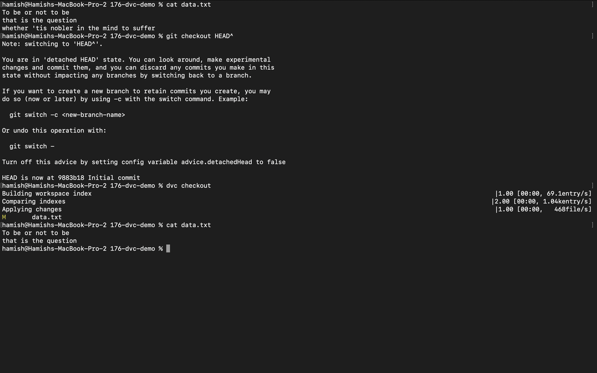

# DVC Demo

**Date:** 14 August 2025

A simple example of DVC (Data Version Control).



1. Install DVC
```bash
pip install dvc
```

2. Initialize Git and DVC
```bash
git init
dvc init
```

3. Initialize data
```bash
echo "To be or not to be
that is the question" > data.txt

dvc add data.txt
git add data.txt.dvc
git commit -m "Initial commit"
```

4. Modify data
```bash
echo "whether 'tis nobler in the mind to suffer" >> data.txt
dvc status
```

5. Add the modified data to DVC
```bash
dvc add data.txt
git add data.txt.dvc
git commit -m "Added another line"
```

6. Revert data
```bash
git checkout HEAD^
dvc checkout
```

7. Inspect the data cache
```bash
ls .dvc/cache/files/md5/*/*
```

8. Inspect which data version is currently checked out
```bash
cat data.txt.dvc
```