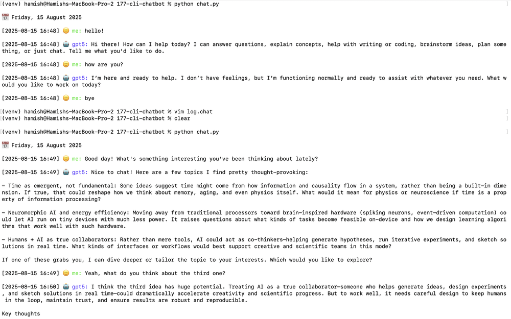

# CLI Chatbot

**Date:** 15 August 2025



This is an elementary CLI chatbot powered by gpt-5-nano through the OpenAI API. The chat is saved in a log file called `chat.log`.

1. Install dependencies:
```bash
pip install -r requirements.txt
```
2. Add your OpenAI API key to the .env file:
```bash
OPENAI_API_KEY=your_api_key
```
3. Run the chatbot:
```bash
python chat.py
```
4. To exit the chatbot, type `bye`, `exit`, or `quit`.
```bash
[2025-08-15 16:50] 🙂 me: bye
```
