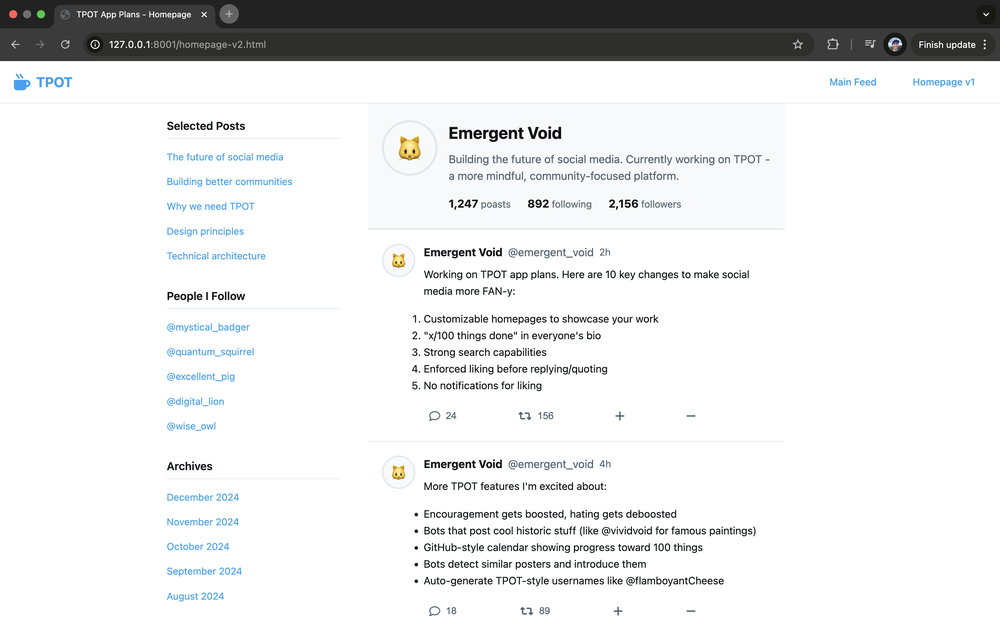
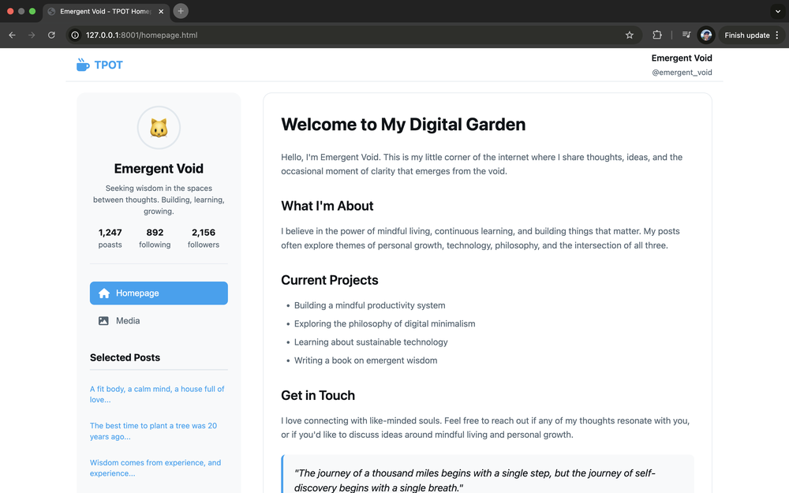

# TPOT App with Homepage

**Date:** August 16 2025

**Previous iteration:** [178-tpot-app](../178-tpot-app)

This is a project in which I iterate towards a variant of twitter which suits me better.

In this iteration I wanted to design a user homepage which feels more like a customizable blog homepage of the Blogspot days:
- sidebar with simply styled links
- blogroll
- highlighted posts
- archive by month

Here's what I came up with:

It's alright. The central column should be centered.

The first version cursor gave me:

