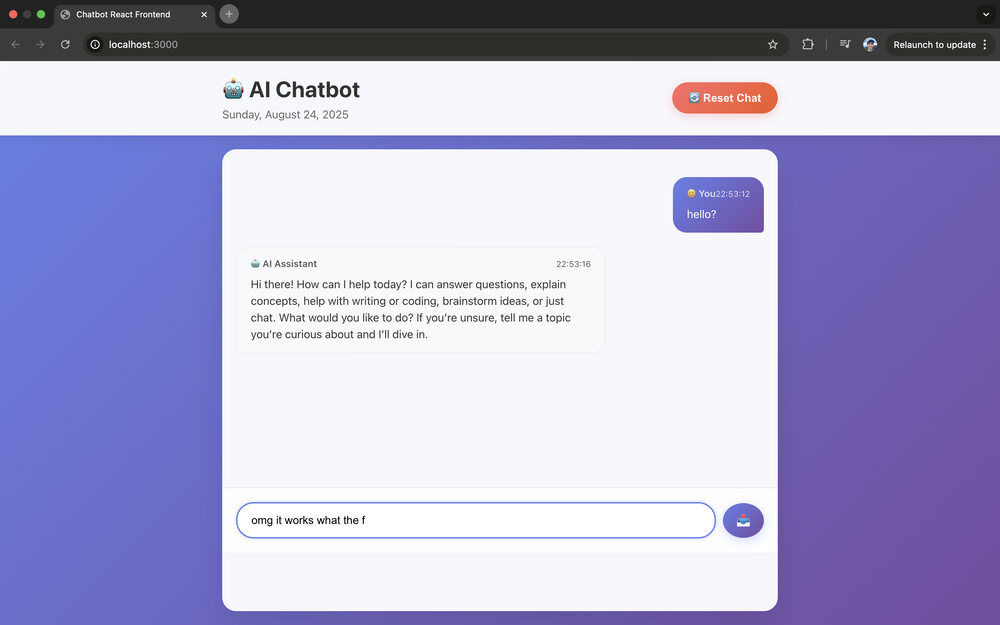

# Chatbot React Frontend

A React frontend for the Python chatbot created in [177-cli-chatbot](../177-cli-chatbox) using the gpt-5-nano model through the OpenAI API.



## Project Structure

```
├── src/
│   ├── components/
│   │   ├── ChatHeader.js      # Header with title and reset button
│   │   ├── ChatMessage.js     # Individual message display
│   │   └── ChatInput.js       # Message input form
│   ├── App.js                 # Main application component
│   ├── App.css                # Main application styles
│   └── index.js               # React entry point
├── public/
│   └── index.html             # HTML template
├── app.py                     # Flask backend API
├── chat.py                    # Original Python chatbot
├── package.json               # React dependencies
└── requirements.txt           # Python dependencies
```

## Setup Instructions

1. Install Python Dependencies

```bash
pip install -r requirements.txt
```

2. Install Node.js Dependencies

```bash
npm install
```

3. Environment Setup

Create a `.env` file in the root directory:

```bash
OPENAI_API_KEY=your_openai_api_key_here
```

4. Start the Backend

```bash
python app.py
```
The Flask server will start on `http://localhost:5000`

5. Start the React Frontend
```bash
npm start
```

The React app will open in your browser at `http://localhost:3000`

## API Endpoints

- `POST /api/chat` - Send a message and get AI response
- `POST /api/reset` - Reset conversation history
- `GET /api/health` - Health check endpoint