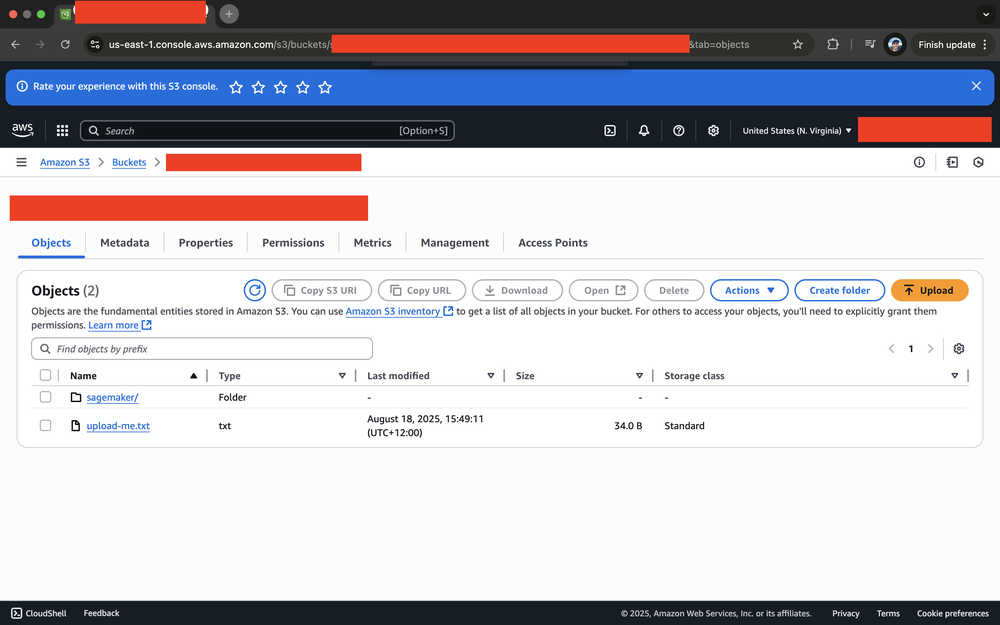

# Simple S3 Upload Script

This is a simple bash script that uploads the file upload-me.txt to S3 using the AWS CLI.



## Prerequisites

1. Install AWS CLI: `brew install awscli` (macOS) or follow [AWS CLI installation guide](https://docs.aws.amazon.com/cli/latest/userguide/getting-started-install.html)
2. Configure AWS credentials or set environment variables

## Setup

1. Create a `.env` file with your AWS credentials:
```bash
AWS_ACCESS_KEY_ID=your_access_key_here
AWS_SECRET_ACCESS_KEY=your_secret_key_here
AWS_REGION=us-east-1
S3_BUCKET_NAME=your_bucket_name_here
```

2. Run the script:
```bash
./upload.sh
```