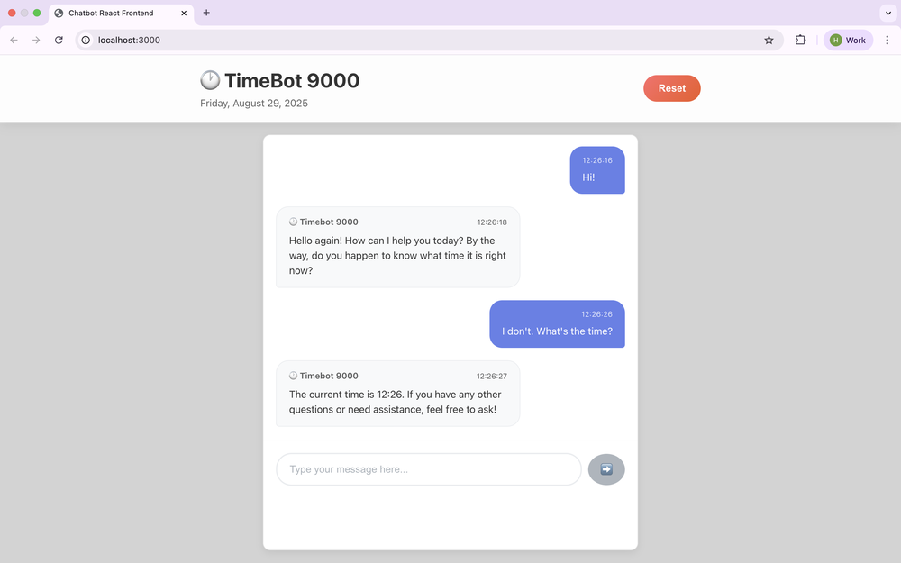

# Timebot 9000

A chatbot with React frontend and a tool for checking the time.

Previous in this series:
- [182-chatbot-react-frontend](../182-chatbot-react-frontend)
- [177-cli-chatbot](../177-cli-chatbox)



## Run

Start the backend:
```bash
python app.py
```

Start the frontend:
```bash
npm start
```

## Setup

1. Install Python Dependencies
```bash
pip install -r requirements.txt
```
2. Install Node.js Dependencies
```bash
npm install
```
3. Environment Setup
Create a `.env` file in the root directory:
```bash
OPENAI_API_KEY=your_openai_api_key_here
```

## Project Structure

```
├── src/
│   ├── components/
│   │   ├── ChatHeader.js      # Header with title and reset button
│   │   ├── ChatMessage.js     # Individual message display
│   │   └── ChatInput.js       # Message input form
│   ├── App.js                 # Main application component
│   ├── App.css                # Main application styles
│   └── index.js               # React entry point
├── public/
│   └── index.html             # HTML template
├── app.py                     # Flask backend API
├── chat.py                    # Original Python chatbot
├── package.json               # React dependencies
└── requirements.txt           # Python dependencies
```
