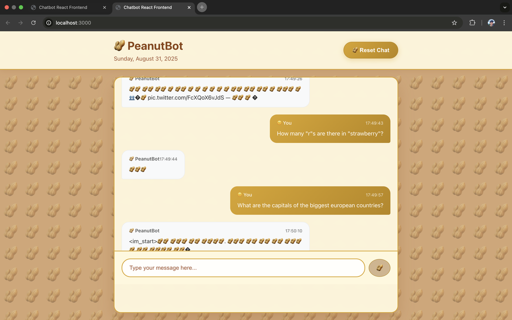

# PeanutBot

As a finetuning exercise, I finetuned TinyLlama (1B parameters) to replace all alphanumeric characters in its speech with the peanut emoji (🥜).



## Setup Instructions

1. Install Python Dependencies

```bash
pip install -r requirements.txt
```

2. Install Node.js Dependencies

```bash
npm install
```

3. Environment Setup

Create a `.env` file in the root directory:

```bash
OPENAI_API_KEY=your_openai_api_key_here
```

4. Start the Backend

```bash
python app.py
```
The Flask server will start on `http://localhost:5000`

5. Start the React Frontend
```bash
npm start
```