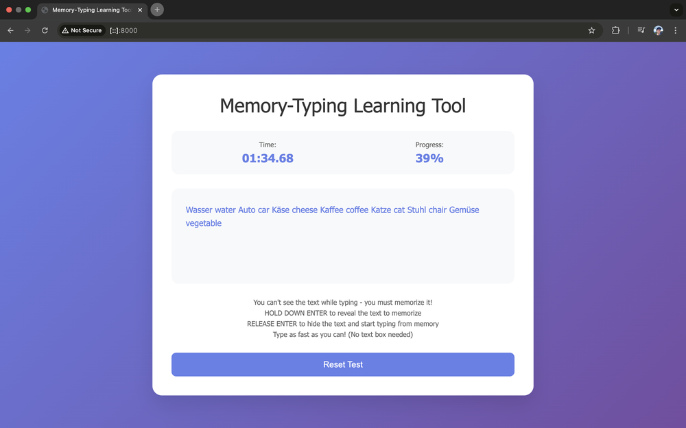

# Memory-Typing Learning Tool

I wanted to create an educational tool to test a few pet theories I have about learning. This is the first prototype of the project.

The learning theory:
- Mastery of a (cognitive) domain is equivalent to being able to memorize large amounts of data pertaining to the domain.
- This idea is inspired by the classic [1973 Chase & Simon study](https://psycnet.apa.org/record/1973-22240-001) in which expert chess players could easily memorize real but not randomized chess boards.
- Often the most efficient way to learn a domain is to practice memorizing data about it.
- The underlying logic will become naturally understood as you figure out patterns and mnemonics to compress data into your brain.
- You can also feel your brain really working when memorizing material with spaced repetition in a way you can't with anything else in my experience.

So this theory would suggest that if a student is struggling to learn algebra, rather than straining to explain what the symbols mean simply set them to work memorizing solutions to algebra problems. This will incentivize them to look for patterns like "the proof always ends with x=<some number>" and "a line with a division on the left side of the equation is followed by a line with multiplication on the right side." They will look for what is constant and what is different between lines of proof. And eventually they may understand.

The question I then had was: can I design a game for memorizing arbitrary domain data which is fun, addictive, and filled with adrenaline?

I had a couple of ideas that seemed ok and I might use later:
- Cookie-clicker style games are really addictive.
- [The worlds most dangerous writing app](https://www.theworldsmostdangerouswritingapp.com/) is high adrenaline.

But the best idea was:
- Typing games are both high adrenaline and addictive. Ie, the games where you have to type out text as quickly as possible to learn typing.
- You always want to beat your previous time and you can clearly feel the mastery happening.

So how to turn a typing game into an arbitrary data memorisation game?
- You have a text box in which you need to type some text as quickly as possible like a typing game.
- But you can't see the text while typing, you have to store it in memory.
- You can hold down the space bar to reveal the text you need to memorize.
- Then lift the space bar to bring back the typing window and start typing again.
- The faster you can memorize the data and the fewer times you have to press space, the faster you'll be able to type out all the data.
- So if you set the text to memorize to be, for example, pairs of German words and their English translation arranged in a random order, then you can incrementally master the German/English word pairs.
- First you can only memorize a few letters of German at a time. Then you can memorize whole words. Then German/English word pairs. Then several word pairs at once.

This is a basic html/css/js project, so you can run it locally by opening the index.html file in your browser.

Todo:
- make it more like [monkeytype](https://monkeytype.com/).
